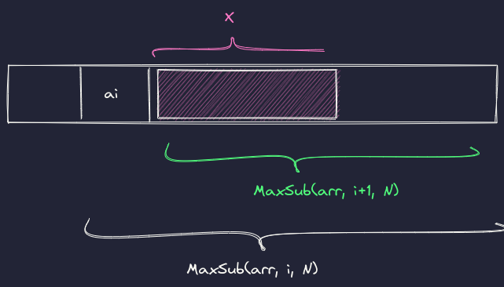

## Maximum Subarray
> Given an integer array `nums`, find the contiguous subarray (containing at least one number) which has the largest sum and return its sum.

Visit the question on [LeetCode](https://leetcode.com/problems/maximum-subarray/).

### First Solution
The simplest solution is to brute force all the possible combinations. Each subarray has a `startIndex` and `endIndex`. We can simply iterate through all of the possible values and then calculate the sum and store the max value in `maxSum`. This is how our first solution will look like:
```go
const INF = 1<<32 - 1

func sumArray(nums []int, start, end int) int {
	sum := 0
	for i := start; i <= end; i++ {
		sum += nums[i]
	}
	return sum
}

func MaxSubArray1(nums []int) int {
	N := len(nums)
	maxSum := -INF
	for start := 0; start < N; start++ {
		for end := start; end < N; end++ {
			ans := sumArray(nums, start, end)
			if ans > maxSum {
				maxSum = ans
			}
		}
	}
	return maxSum
}
```
### Second Solution (Divide & Conquer)
Other thing we can look for is to see how we can divide the problem into sub-problems of the smaller instances. The first way to look at it is adding start index and end index to the problem instance so it become little bit more well-defined.

`MaxSub(arr, i, j) = max { max {a[i], a[i] + x} , MaxSub(arr, i+1, j)}`



But what is `x`? `x` is the maximum sum of subarray starting from index `i+1`. But we don't want to compute that independently. The reason is we can combine that into `MaxSub` so we don't have to add extra computation for that that. In Go we can make our function multiple values. So with each function call we would get two values. The first one would be the largest sum of maximum subarray and the other gives us the largest sum of maximum subarray if we were to start from the start index.

So the recursion would be something like this:
```python
MaxSub(arr, i, j) = 
	max{ max {a[i], a[i] + MaxSub(arr, i+1, j)[2]} , MaxSub(arr, i+1, j)[1]},
	 max{a[i], a[i] + MaxSub(arr, i+1, j)[2]}
```
Let's code it in go:
```go
func max(n1, n2 int) int {
	if n2 > n1 {
		return n2
	} else {
		return n1
	}
}

func maxSubArrayHelper(nums []int, start int) (int, int) {
	if len(nums)-1 < start {
		return -INF, -INF
	} else {
		maxSum, maxConSum := maxSubArrayHelper(nums, start+1)
		newMaxConSum := max(nums[start], nums[start]+maxConSum)
		return max(newMaxConSum, maxSum), newMaxConSum
	}
}

func MaxSubArray2(nums []int) int {
	ans, _ := maxSubArrayHelper(nums, 0)
	return ans
}
```

### Third Solution (Dynamic Programming)
We don't have any repeating instance in our divide and conquer solution but we still can get rid of the recursion. The way to look at it is, instead of breaking the problem, we start from the smallest problem and find our way up to the solution to the original problem.

We start from the solution to the `S(arr, 1, 1)` then we remember two thing we need as we did with previous solution. The `MaxSub` and the maximum sum containing the last last element, which we would call `MaxSubCon`. The code would be straight forward.

```go
func MaxSubArray3(nums []int) int {
	maxSubCon := nums[0]
	maxSubSum := nums[0]
	for i := 1; i < len(nums); i++ {
		if nums[i]+maxSubCon > nums[i] {
			maxSubCon = nums[i] + maxSubCon
		} else {
			maxSubCon = nums[i]
		}
		if maxSubCon > maxSubSum {
			maxSubSum = maxSubCon
		}

	}
	return maxSubSum
}
```
